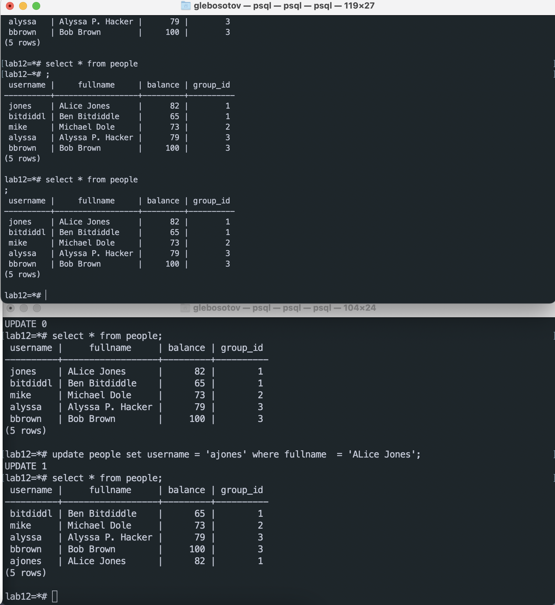
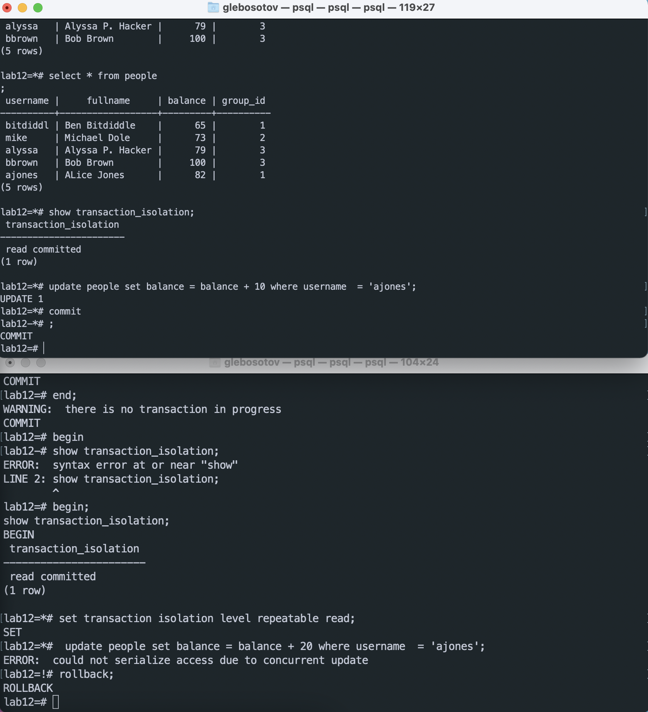
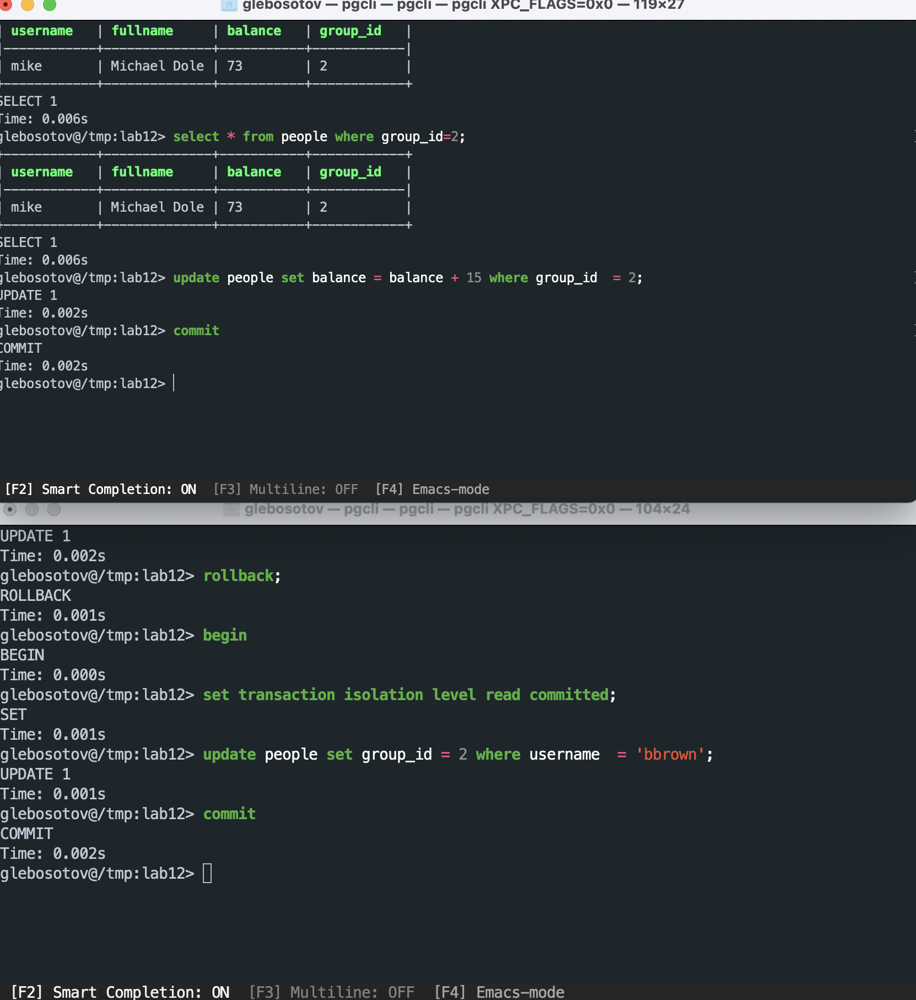

## Exercise 1

After **step 4** terminals show different outputs, because in `repeatable read`, `dirty read` is not possible

 

After **step 8** serialisation anomaly occurred

## Exercise 2

### Read commited & repeatable read

For both these isolation levels, until T2 was commited, T1 will not update Bob's `group_id`. 

## Exercise 3

In both cases the T1 can not see the change. Mike's balance is doubled in both cases.