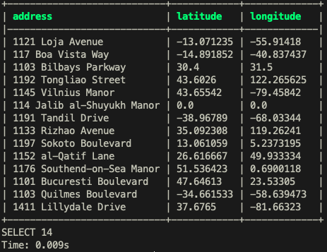
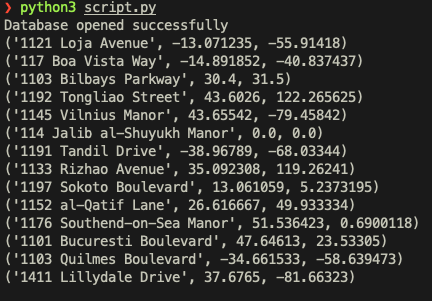

# Exercise 1

## Gleb Osotov B19-03


### Screenshots of the result:





### Below are the script and queries

#### Comments on script (what it does):

- connect to DB
- delete columns latitude and longitude
- select requested rows
- connect to geoPy and get the lat, lon
- Update values in db
- Print the updated rows **FROM DB ITSELF**

```python
from geopy.geocoders import Nominatim
import psycopg2
# change these to connect
user = "glebosotov"
password = ""
con = psycopg2.connect(database="dvdrental", user=user,
                       password=password, host="127.0.0.1", port="5432")
print("Database opened successfully")


cur = con.cursor()
cur.execute("""ALTER TABLE address
DROP  COLUMN IF EXISTS latitude, DROP  COLUMN IF EXISTS longitude;""")
cur.execute("""CREATE OR REPLACE FUNCTION get_addresses()
            RETURNS TABLE(name VARCHAR, id INT) AS
            $$ BEGIN
            RETURN QUERY
            select address, address_id from address where city_id > 400 and city_id < 600 and address.address like '%11%';
            END
            $$ LANGUAGE plpgsql
            """)

cur.callproc('get_addresses')
row = cur.fetchall()


geolocator = Nominatim(user_agent="lab")

list = []

for i in range(len(row)):

    # print('.', end='')
    location = geolocator.geocode(row[i][0])
    if location is not None:
        # print(location.raw)
        list.append(
            [row[i][0], row[i][1], location.latitude, location.longitude])
    else:
        list.append([row[i][0], row[i][1], 0.0, 0.0])


cur.execute("""ALTER TABLE address
ADD latitude REAL, ADD longitude REAL;""")

update_query = """ UPDATE address SET latitude = %s, longitude = %s WHERE address_id = %s"""

for i in list:
    cur.execute(update_query, (i[2], i[3], i[1]))

cur.execute("select address, latitude, longitude from address where city_id > 400 and city_id < 600 and address.address like '%11%'")
result = cur.fetchall()


for i in result:
    print(i)


con.commit()
cur.close()
con.close()

```

```sql
-- Query for functuon creation
CREATE OR REPLACE FUNCTION get_addresses()
            RETURNS TABLE(name VARCHAR, id INT) AS
            $$ BEGIN
            RETURN QUERY
            select address, address_id from address where city_id > 400 and city_id < 600 and address.address like '%11%';
            END
            $$ LANGUAGE plpgsql;
            
-- Query for updating values
UPDATE address SET latitude = %s, longitude = %s WHERE address_id = %s
```

